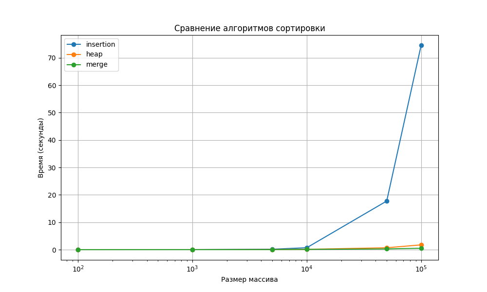

# Лабораторная работа 1 (Вариант 23)

## Общее задание

1) Реализовать на языке C++ программирования сортировки для массива объектов в  соответствии с вариантом.
2) Перегрузить операторы сравнения (>, <, >=, <=) для сравнения  объектов. Правила сравнения указаны в варианте.
3) Входные данные для сортировки массива обязательно считывать из  внешних источников: текстовый файл, файлы csv, xlsx, данные из СУБД (любое на выбор). Выходные данные (отсортированный массив) записывать в файл.
4) Выбрать 10-20 наборов данных для сортировки размерности от 100 и  более (но не менее, чем до 100000). Засечь (программно) время сортировки  каждым алгоритмом и std::sort. По полученным точкам построить графики  зависимости времени сортировки от размерности массива для каждого из алгоритмов сортировки на одной оси координат. Сделать выводы о  том, в каком случае, какой из методов лучше применять.
5) Сделать отчет, состоящий из: документации к коду работы, сгенерированную с помощью case средства (doxygen, sphinx, etc); ссылку на исходный код программы в репозитории; графики времени сортировок.

## Варианты сортировок

У меня реализованы следущие сортироки:

- Сортировка простыми вставками
- Пирамидальная сортировка
- Сортировка слиянием

Вот графики со сравнением сортировок:


## Данные

Массив данных о кораблях:

- название корабля
- год постройки
- страна постройки
- тип корабля (танкер, сухогруз,  пассажирский)
- ФИО капитана

Cравнение по полям – год  постройки, название корабля, тип корабля;

## Как запустить

Сборка проекта:

```bash
mkdir build && cd build && cmake ..
```

Компиляция проекта:

```bash
cmake --build .
```

Запуск сортироки на C++:

```bash
./sort_ships  <csv_filename> <algorithm>
```

Запуск кода на Python для отчета:

```bash
python3 utils/sort_benchmark.py
```

*Примечание*: Этот код в автоматическом режиме запустит тестирование на скорость работы алгоритмов

## Документация

Создание документации:

```bash
doxygen Doxyfile
```

Запуск в браузере:

```bash
xdg-opendocs/ html/index.html  # Linux
open docs/html/index.html      # MacOS
start docs\html\index.html     # Windows
```
